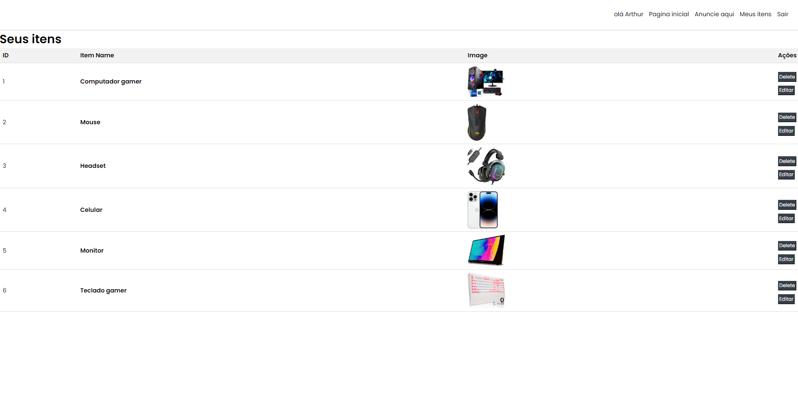
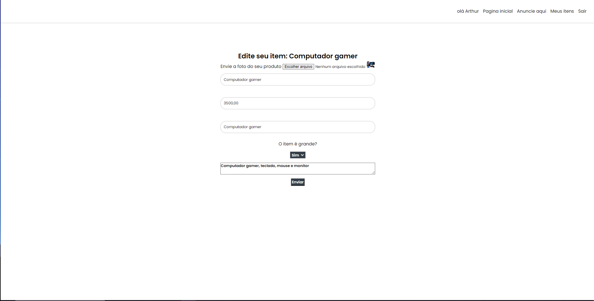

<h1>Shop Close</h1>

Um projeto desenvolvido em Laravel, Laravel Jetstream, mysql, html e css. Esse é um projeto mais focado no back-end de um E-comerce

<h3>Tecnologias usadas</h3>
<li>Laravel: framework PHP de código aberto que permite o desenvolvimento rápido e fácil de aplicativos web </li>  
<li>Laravel JetStream:  pacote oficial do Laravel que oferece uma estrutura para autenticação e gerenciamento de equipes de usuário. Ele inclui recursos como autenticação por e-mail, autenticação de dois fatores, configurações de perfil, gerenciamento de sessão </li>  
<li>MYSQL: sistema de gerenciamento de banco de dados relacional </li>  
<li>HTML: Linguaguem de marcação </li>  
<li>CSS: Linguaguem de estilização </li>  

<h3>Pré-requisitos</h3>
Antes de executar o projeto localmente, certifique-se de ter as seguintes ferramentas instaladas em sua máquina:

PHP e MySQL:  caso for windows faça uso do XAMPP, ele oferece uma instalação simples e completa do PHP e do MySQL.

Composer: O Composer é uma ferramenta essencial para gerenciar as dependências do Laravel. Certifique-se de tê-lo instalado corretamente.

Laravel Framework: instale usando o comando: "composer global require laravel/installer"

MySQL Workbench: Facilita a administração do banco de dados MySQL e pode ser útil para criar um novo Schema.

<h3>Executando o Projeto Localmente</h3>
1. Clone o Repositório: Faça um clone deste repositório em seu sistema local. https://github.com/Arthurvini17/Shop-close  
2 Crie um Schemma no MYSQL  
3. Instale as Dependências: Abra o terminal na pasta do projeto e execute o comando composer install e composer update para instalar todas as dependências do Laravel.  
4. Configure o Arquivo .env: No diretório do projeto, localize o arquivo .env e configure a variável DB_DATABASE com o nome do Schema que você criou no passo 2.  
5. Execute as Migrações: No terminal, execute o comando php artisan migrate para aplicar as migrações do banco de dados.  
6. Inicie o Servidor: Para executar o projeto, utilize o comando php artisan serve.  

<h1> Imagens do projeto</h1>
<h3> Pagina inicial logado <h3>

<h3> Pagina anunciar item <h3>

<h3> Itens que você criou <h3>

<h3> Pagina editar item <h3>

<h3> Pagina inicial caso não tiver logado com sua conta </h3>

